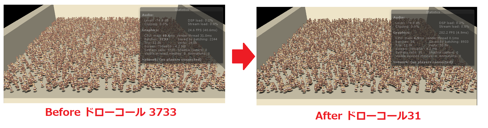
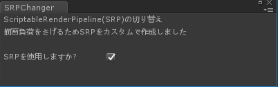
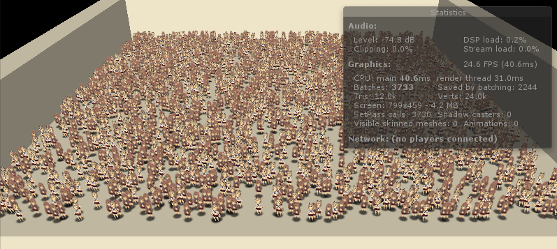
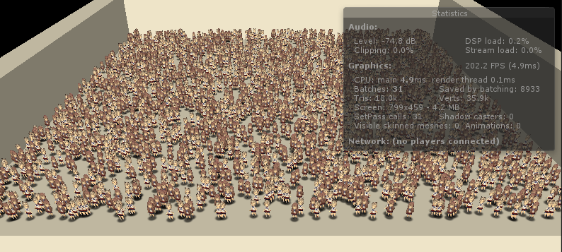
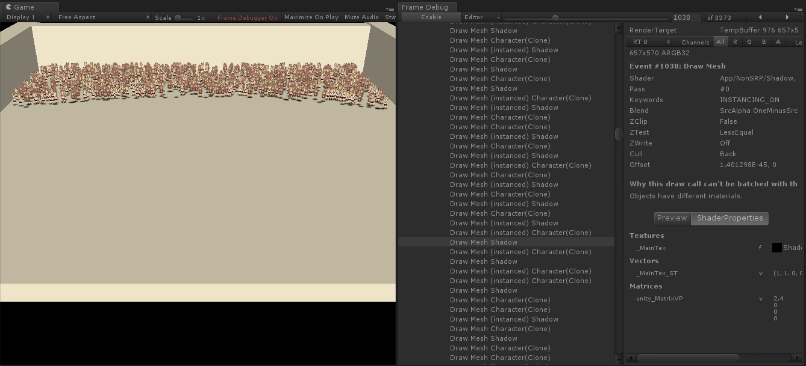
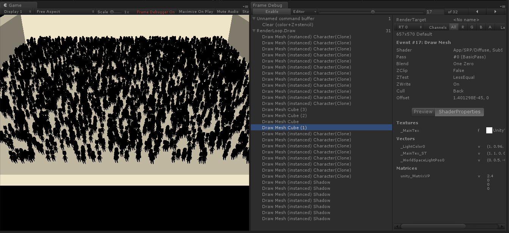
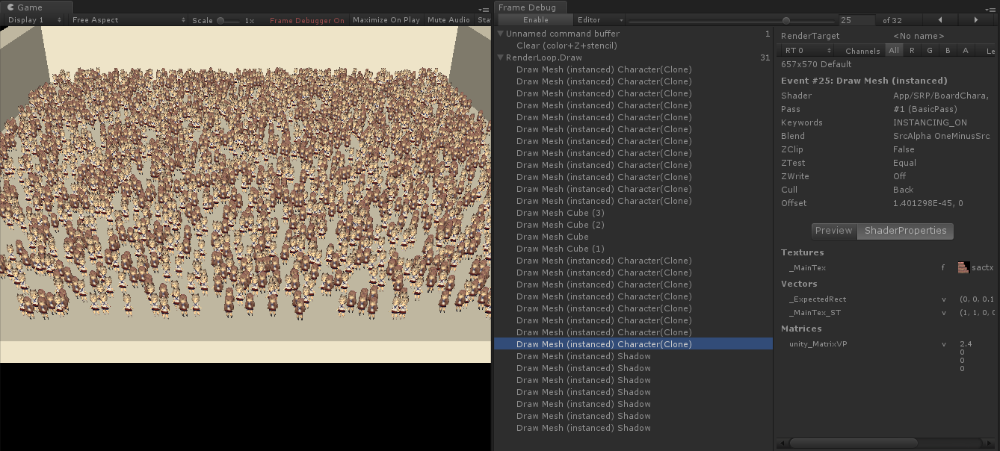
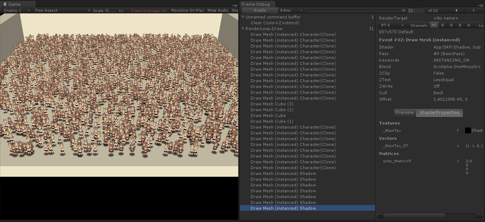

# CustomScriptRenderPipelineTest
## About
このプロジェクトは 自作したScriptableRenderPipeline(SRP)のテスト用に作成しました。 
Unity 2018.1.0b13 で作成を行いました。 
このプロジェクト専用の Shader / 描画パスに特化した形でやっています。 

# 専用のSRPの効果

## SRP使用のオン／オフを切り替えてみる
Menuの「Tools/SRPChanger」のチェックボックスの On/Offを切り替えることで、通常の描画パスと今回の専用描画パスを切り替えられます。 

未使用時は Batches 3733

今回専用のRenderingパス時は Batches 31

専用に用意することで凄く軽くすることが出来ました。

## かるく解説
### 通常のパス
通常では、Transparentは描画の破綻を防ぐため「奥から手前」に描画をします。 
今回表示しているキャラクターや影は Spriteで表現していますので、α付のTexture表示になっています 

レンダリングの破綻を防ぐため、下記の様に「奥から手前」を遵守します。 
そのため、「影→キャラクター→影」という形でマテリアルを沢山切り替えながら描画をしますので、バッチ数は膨らみます。 

### 今回カスタムの描画パス
今回は、下記手順で書き込んでいます。

1.先にキャラクターのαが0ではない箇所のみ、ZBufferに書き込み 
2.床や壁の描画 
3.キャラクターの実体をZTestで一致した所のみ描画するようにする 
4.最後に影を深度テストありで一気に書き込む 

このようにすることで、マテリアル切り替えを抑え描画するようにしています。 

FrameDebuggerで下記の様になっています。

## ソース等

MyScriptableRenderPipeline.cs にてレンダリング関連の処理を行っています。 
ScriptableRenderPiepeline使用時には、「Tags { "LightMode" = "BasicPass"}」と言う形で描画用のパスタグを宣言する必要があります。 

そのため、今回はSRP使用のための専用Shaderを書きました。 
「Assets/Shaders/SRP」こちらが SRP使用時に利用する Shader 
 
通常時には、「Assets/Shaders/NonSRP」を利用して描画しています。
